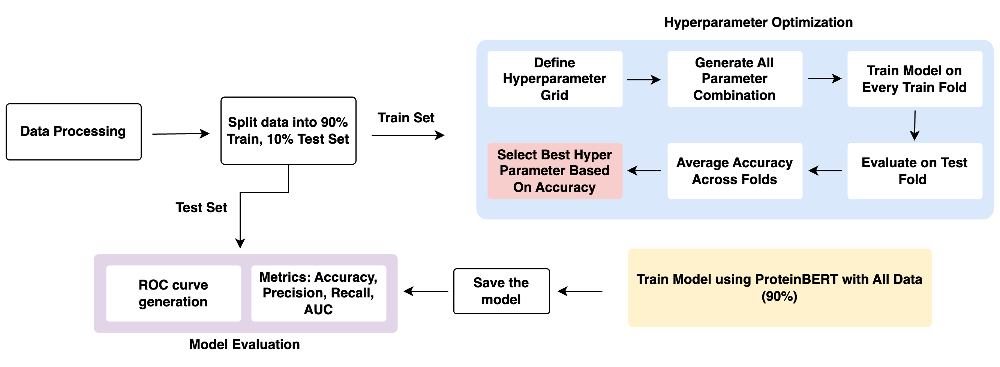
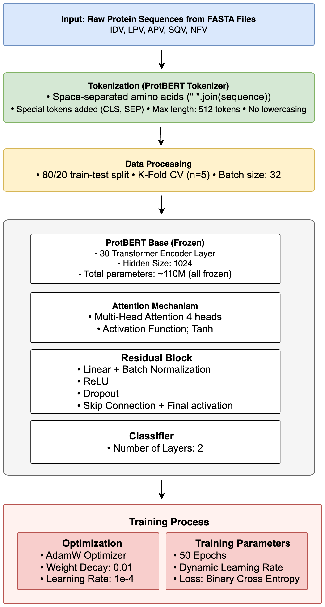

# 🧬 Protein Sequence Modeling for HIV Protease Drug Resistance

This project applies **ProteinBERT** to predict **drug resistance vs. susceptibility** from **HIV protease amino acid sequences**.  
The model integrates **explainable AI methods** to highlight biologically meaningful residues, offering insights into mechanisms of drug resistance.

---

## 📌 Project Overview
- **Objective**: Predict whether an HIV protease sequence is **resistant or susceptible** to treatment.  
- **Model**: Fine-tuned **ProteinBERT** for sequence classification.  
- **Dataset**: Curated HIV protease amino acid sequences labeled for resistance/susceptibility.  
- **Performance**: Achieved **AUROC 0.88**, outperforming baseline methods.  
- **Explainability**: Incorporated **saliency maps** and **integrated gradients** to highlight toxicity-relevant residues.  

---

## ⚙️ Methodology
1. **Data Preparation**
   - Collected HIV protease sequences and curated resistance/susceptibility labels.  
   - Preprocessed into ProteinBERT-compatible tokenized sequences.  

2. **Model Training**
   - Fine-tuned **ProteinBERT** with classification head.  
   - Evaluated with cross-validation.  

3. **Explainability**
   - Used **saliency maps** and **integrated gradients** to identify key amino acids influencing predictions.
  
4. **Overall Architecture**
   

5. **Model**
   

---

## 📊 Results
- **AUROC**: 0.88  
- **Accuracy**: 82%  
- Highlighted residues aligned with known **drug resistance mutation sites**.  

  

  

---

## 🛠️ Tech Stack
- **Python 3.10+**  
- **PyTorch**  
- **ProteinBERT**  
- **scikit-learn**  
- **Captum (for explainability)**  
